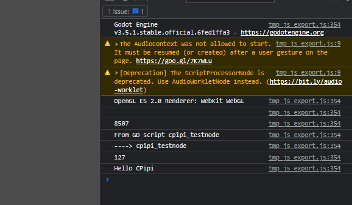
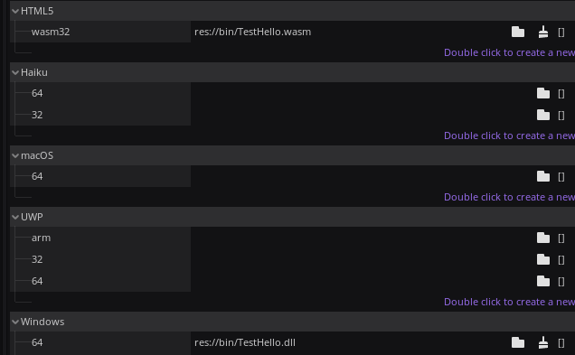

# Godot (C++) gdnative compilation

# Dependencies
- Cmake (Tested on  3.26.0-rc4 version);
- Emscripten (Working with the latest version);
    - [Emscripten Documentation](https://emscripten.org/docs/getting_started/downloads.html)
- For windows, generator Visual Studio 17 2022 installed;
- Mingw (Used msys64, on windows);
- Python installed;

---
# Test file structure
This was just the test folder struct, not mandatory

```
root
|- godot-project
|   |- bin
|   |   |- TestHello.dll
|   |   |- TestHello.wasm
|   |- ( ... )
|   |- project.godot
|
|- native
|- godot-cpp (cloned repository)
|- src 
|   |- CMakeLists.txt
|   |- (Source code)
| - CMakeLists.txt 
```
# Compilation
## Windows dll 
<br />
    
- On the native folder (only worked), call ```cmake .``` to generate (On windows it should use Visual Studio 17 **tested**);
- Call ```cmake --build .``` to build the dll;

## Wasm
<br />

- Follow the emscripten setup instruction
```bash
    # Activate PATH and other environment variables in the current terminal
    source ./emsdk_env.sh
```
- On the native folder call ```emcmake cmake -S . -B build_wasm```, creates a build_wasm folder and generate using MingW;
- ```cmake --build build_wasm/```, builds the configuration on build_wasm folder, generating the .wasm;

---
### Prints

```Chrome console```


``` GdLib ```


---
### Notes
- Context: the printed int is the ms time for the same loop ms duration on gd and c++
    
```cpp
    // Cpp is 65x~ faster for this exemple
    for (int i = 0; i < 20000000; i++) {
    accum += i % 2 ;
}
```
